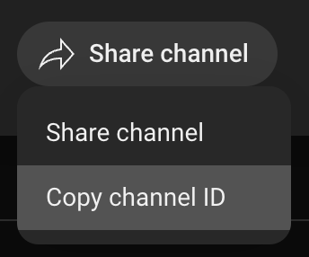
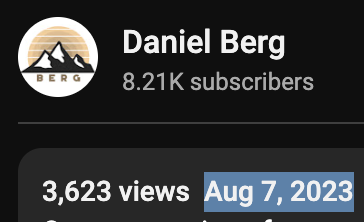

# Contributing

We love our contributors! Here's how you can contribute:

- [Open an issue](https://github.com/danielbergholz/techschool.dev/issues) if you believe you've encountered a bug.
- Make a [pull request](https://github.com/danielbergholz/techschool.dev/pull) to add new features/make quality-of-life improvements/fix bugs.

## Adding a new programming language

- Add a new entry on the JSON file `priv/repo/data/languages.json`. The file should have the following structure:

```json
{
  "name": "Programming Language Name", // case sensitive
  "image_url": "path_to_the_language_svg" // should be inside priv/static/images/languages
}
```

If you don't want to manually add an SVG for the `image_url` field, don't worry about it. I'll take care of it. Just add the language name.

## Adding a new framework

- Add a new entry on the JSON file `priv/repo/data/frameworks.json`. The file should have the following structure:

```json
{
  "name": "Framework Name", // case sensitive
  "image_url": "path_to_the_framework_svg" // should be inside priv/static/images/frameworks
}
```

Same note as the `image_url` field from the `languages.json` file. Don't worry about it.

## Adding a new tool

- Add a new entry on the JSON file `priv/repo/data/tools.json`. The file should have the following structure:

```json
{
  "name": "Tool Name", // case sensitive
  "image_url": "path_to_the_tool_svg" // should be inside priv/static/images/tools
}
```

## Adding a new "fundamentals"

- Add a new entry on the JSON file `priv/repo/data/fundamentals.json`. The file should have the following structure:

```json
{
  "name": "Fundamentals Name", // case sensitive
  "image_url": "path_to_the_fundamentals_svg" // should be inside priv/static/images/fundamentals
}
```

Same note for `image_url`. Don't worry about it.

## Adding a new channel

- Add a new entry on the JSON file `priv/repo/data/channels.json`. The file should have the following structure:

```json
{
  "name": "Channel Name", // case sensitive
  "image_url": "url_from_the_channel_image",
  "youtube_channel_id": "uuid_from_youtube"
}
```

- To get the `image_url`, go to the channel's page on YouTube and right-click on the image. Then, click on "Copy image link" and paste it on the `image_url` field.
- To get the `youtube_channel_id`, go to the channel's page on YouTube and copy the last part of the URL. For example, if the URL is `https://www.youtube.com/channel/UCnmbV9eyMwIl50Ji1ObFxqg`, the `youtube_channel_id` is `UCnmbV9eyMwIl50Ji1ObFxqg`. Alternatively, you can click on the channel's description, which will pop up an "about modal" with the channel's description, links and down below there is a "share channel" button. Click on it, then click on "Copy channel ID" and paste it on the `youtube_channel_id` field.

<p align="center">
  
</p>

## Adding a new course

- Add a new entry on the JSON file `priv/repo/data/courses.json`. The file should have the following structure:

```json
{
  "name": "Course Name", // case sensitive
  "youtube_course_id": "uuid_from_youtube",
  "type": "playlist", // "playlist" or "video"
  "locale": "en", // "en" or "pt"
  "image_url": "url_from_thumbnail",
  "published_at": "published_at_date", // ISO 8601 format, example: "2022-06-16T00:00:00Z" (YYYY-MM-DD + "T" + HH:MM:SS + "Z")
  "youtube_channel_id": "uuid_from_youtube", // must be present inside channels.json
  "language_names": ["Programming Language Name"], // must be present inside languages.json (case sensitive)
  "framework_names": ["Framework Name"], // must be present inside frameworks.json (case sensitive)
  "tool_names": ["Tool Name"], // must be present inside tools.json (case sensitive)
  "fundamentals_names": ["Fundamentals Name"] // must be present inside fundamentals.json (case sensitive)
}
```

- To get the `youtube_course_id`, go to the course's page on YouTube and copy the last part of the URL. For example, for a video, if the URL is `https://www.youtube.com/watch?v=kUMe1FH4CHE`, the `youtube_course_id` is `kUMe1FH4CHE`. For a playlist, if the URL is `https://www.youtube.com/watch?v=3LPWQtvxHOk&list=PLbV6TI03ZWYWwU5p9ZBH8oJTCjgneX53u`, the `youtube_course_id` is `PLbV6TI03ZWYWwU5p9ZBH8oJTCjgneX53u`.
- To get the `image_url`, go to the youtube channel that the course belongs to and try to find the course you want to add. Then, right-click on the course image and click on "Copy image link". Paste it on the `image_url` field
- The `youtube_channel_id` must be present inside `channels.json`
- The `published_at` field is the date when the course was published. You can find this information on the course's description on YouTube (after you click on it). Don't worry about the exact time, you can use just the date, like `2022-06-16T00:00:00Z` (YYYY-MM-DD + "T00:00:00Z").

<p align="center">
  
</p>

### Important notes

The programming language, framework and tool for the course must be exactly what is being taught in the course. If the course is only about Rails, `framework_names` should be `["Rails"]` but `language_names` and `tool_names` should be empty. If the course is about Ruby, `language_names` should be `["Ruby"]` and `framework_names` and `tool_names` should be empty.

You should only add multiple languages/frameworks if the course teaches multiple languages/frameworks. For example: If there is a "complete web development" course that teaches HTML, CSS, JavaScript, SQL, Ruby, Rails and React, then `language_names` should be `["HTML", "CSS", "JavaScript", "Ruby"]`, `framework_names` should be `["Rails", "React.js"]` and `tool_names` should be `["SQL"]`.

## Adding a new website

- If you want to add an external platform/website like FreeCodeCamp or The Odin Project, add a new entry on the JSON file `priv/repo/data/platforms.json`. The file should have the following structure:

```json
{
  "name": "Website Name", // case sensitive
  "description_en": "English description",
  "description_pt": "Brazilian Portuguese description",
  "url": "https://example.com/",
  "image_url": "path_to_the_website_svg", // should be inside priv/static/images/platforms
  "language_names": ["Programming Language Name"], // must be present inside languages.json (case sensitive)
  "framework_names": ["Framework Name"], // must be present inside frameworks.json (case sensitive)
  "tool_names": ["Tool Name"], // must be present inside tools.json (case sensitive)
  "fundamentals_names": ["Fundamentals Name"] // must be present inside fundamentals.json (case sensitive)
}
```

### Important note

Currently, only websites that offer completely free content should be added. If a website includes a paid version or subscription, it will not be added. The goal is to only promote free resources for learning.

## FAQ

### This is too much work, I just want to add a course!

I know. I'm working to make this whole process easier. In the meantime, if you want to add a course, just open an issue with the course details and I'll add it for you.

### What type of content can I add?

The primary focus of this plataform is web development courses. But feel free to also add content for: Data Science, Machine Learning, DevOps, Mobile Development, etc.

### What type of content can I not add?

- Content that is not related to programming. This includes: music, movies, TV shows, etc.
- Content from creators with any type of bad behavior, like: racism, sexism, homophobia, etc. This is completely unacceptable.

## Go back

[README](../README.md)
